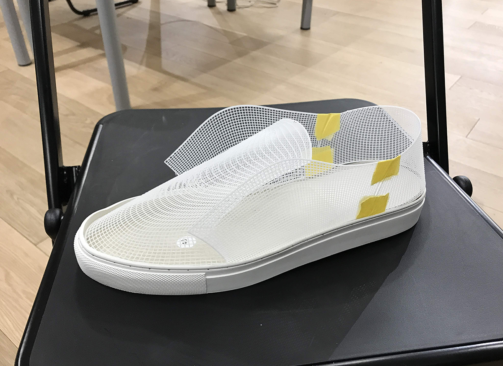

# Shoes-3DPrinted  

### Pattern Edit (190524)  

元はこれ  
[https://www.sneakerkit.eu/](https://www.sneakerkit.eu/)  

3Dプリンタの造形サイズ組み立て効率等々を考慮し、型紙を変更。  
型紙を立体に組み立てる。適当に切り貼りして修正。マステで固定。切り分けて型紙に...  

  

  

  

これを展開する。  
A3サイズ。  

  

---  

### Print Test (190527)  

起こした型紙をベースにプリントテスト。  
ベットのサイズや、レイヤー数と硬さの関係等々調べた。  

サーフェスを UV 方向に走査+輪郭を一周のデータを作成。  
4層で結構硬かったので、条件を変えながら試す。  
2層で良さそう。

グリッドの細かさ試しながら 1mm X 1mm くらいがいい感じ。  

シュータンの部分を分けてプリントすると、組み立て部分が固いので微妙。  

  

一体型に。  

底の部分での立ち上がりが 1.5mmくらいあるので、意外と余裕がありそう。    
ちょっと修正がいるかな。  

---  